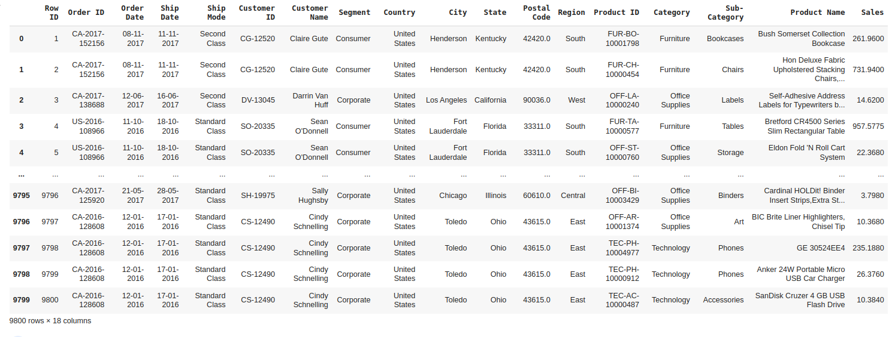
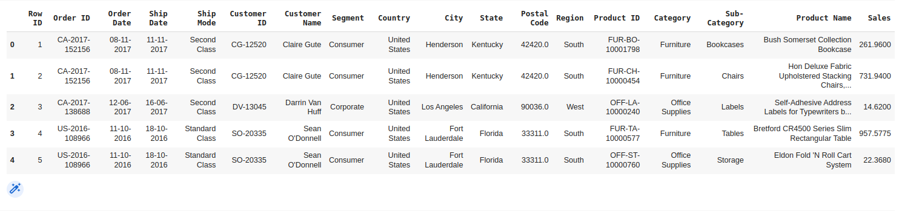
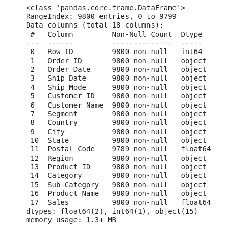
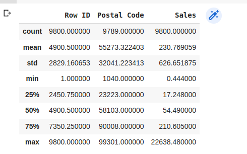
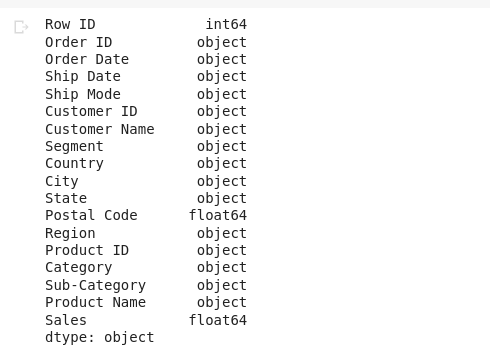
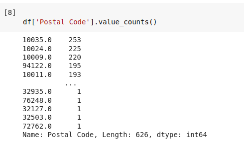
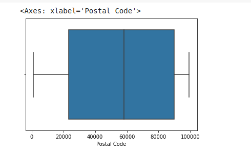
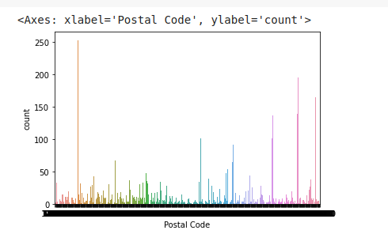
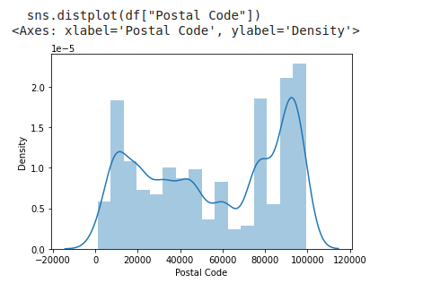
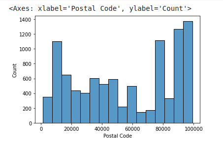

# Ex03-Univariate-Analysis


## Aim:

To read the given data and perform the univariate analysis with different types of plots.

## Explanation:

Univariate analysis is basically the simplest form to analyze data. Uni means one and this means that the data has only one kind of variable. The major reason for univariate analysis is to use the data to describe. The analysis will take data, summarise it, and then find some pattern in the data.

## Algorithm:

## Step1:

Read the given data.

## Step2:

Get the information about the data.

## Step3:

Remove the null values from the data.

## Step4:

Mention the datatypes from the data.

## Step5:

Count the values from the data.

## Step6:

Do plots like boxplots,countplot,distribution plot,histogram plot.

## Program:

DEVELOPED BY : BRINDHA R

REG NO : 22008265
```
import pandas as pd
import numpy as np
import seaborn as sns

df=pd.read_csv('superstore.csv')
df

df.head()
df.info()
df.describe()
df.isnull().sum()

df.dtypes

df['Postal Code'].value_counts()

sns.boxplot(x='Postal Code', data=df)
sns.countplot(x='Postal Code',data=df)
sns.distplot(df["Postal Code"])
sns.histplot(x='Postal Code',data=df)
```
## Output:

## Dataset:



## Head:



## Info:



## Describe:



## Isnull:



## dtypes:


## Valuecount:



## Boxplot:



## Countplot:



## Distribution plot:




## Histogram plot:



## Result:

Thus we have read the given data and performed the univariate analysis with different types of plots.
